<h1 align="center">🚢 Titanic Dataset – Exploratory Data Analysis (EDA)</h1>

The notebook analyzes different patterns from the infamous titanic datatset. It includes finding survival rates based on factors like sex, age, passenger class, etc.

---

## 📄 Overview

This notebook performs an in-depth Exploratory Data Analysis (EDA) on the Titanic dataset to understand how different factors such as **sex**, **age**, **passenger class**, **fare**, and **embarkation point** influenced survival.

---

## 📓 This notebook contains the following

### 1. 📊 Dataset Metadata Exploration

-   Preview of the first 5 rows with `titanic.head()`
-   Basic dataset info: shape, column types, and column names
-   Descriptive statistics using `describe(include="all")`

---

### 2. 🧼 Missing Values Analysis

-   Visualized missing data using a **heatmap**

    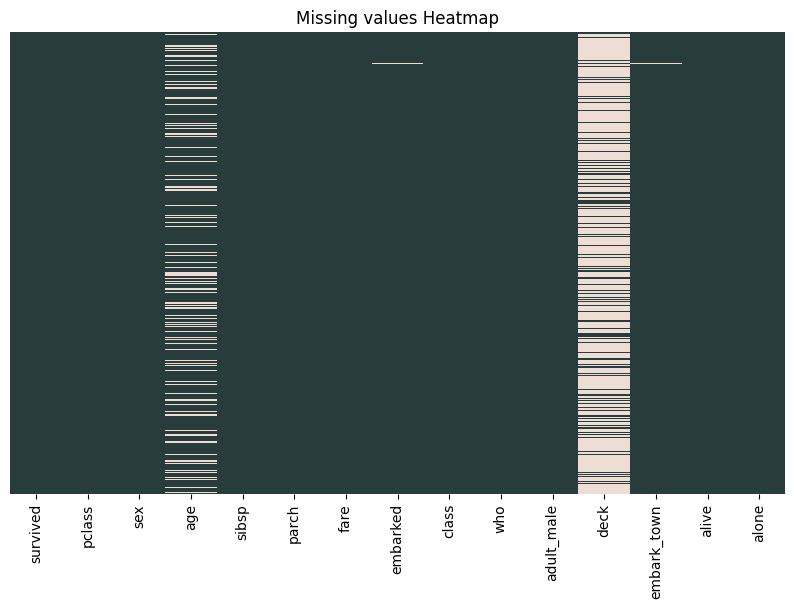

-   Missing values imputed using:
    -   `IterativeImputer` with `RandomForestRegressor` for numerical features
    -   Mode imputation for categorical features

---

### 3. 📈 Univariate analysis:

#### 🚶‍♂️ Survival count (`countplot`)

    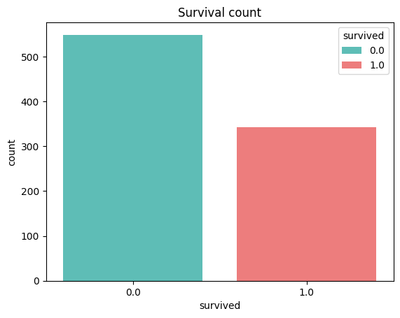

#### 🛏️ Passenger Class Distribution (`countplot`)

    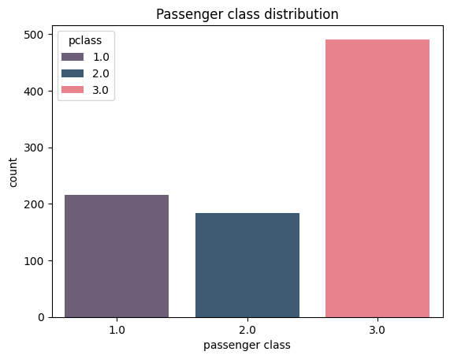

#### 🧭 Age Distribution (`histplot`)

    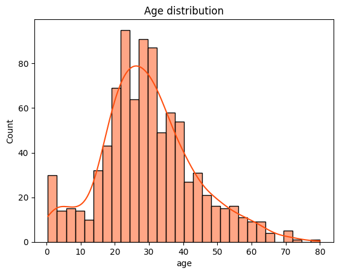

#### 🧬 Sex Distribution (`countplot`)

    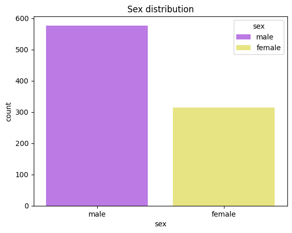

---

### 4. 📊 Bivariate analysis:

#### 🚶‍♂️ Survival rate **v/s** 🧬 Sex (`countplot`)

    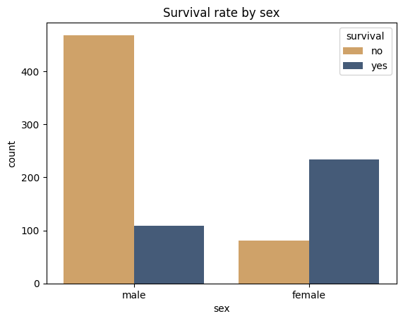

#### 🚶‍♂️ Survival rate **v/s** 🛏️ Passenger Class (`countplot`)

    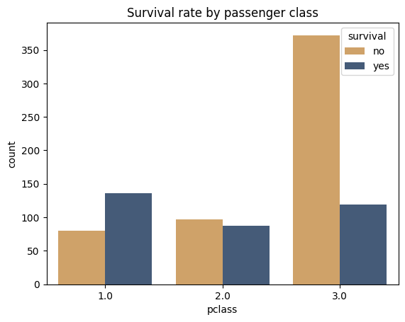

#### 🚶‍♂️ Survival rate **v/s** 🧭 Age Group

    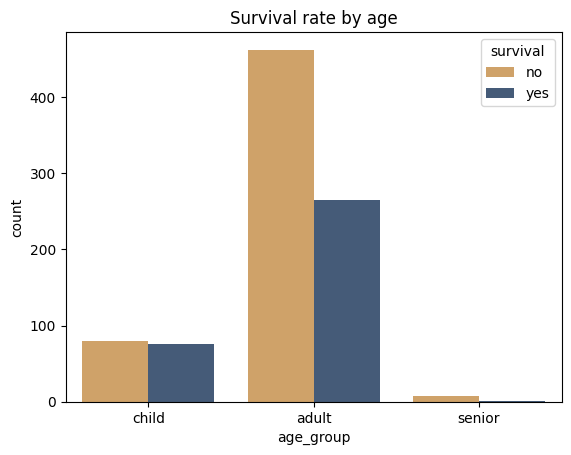

---

### 5. 🔀 Multivariate Analysis

#### 🚶‍♂️ Survival rate **v/s** 🧬 Sex **v/s** 🛏️ Passenger Class (`catplot`)

    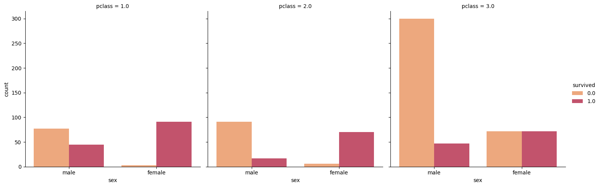

---

### 6. ❤️‍🩹 Survival Analysis

#### ⚓ Survival rate based on Embarkment point (`countplot`)

    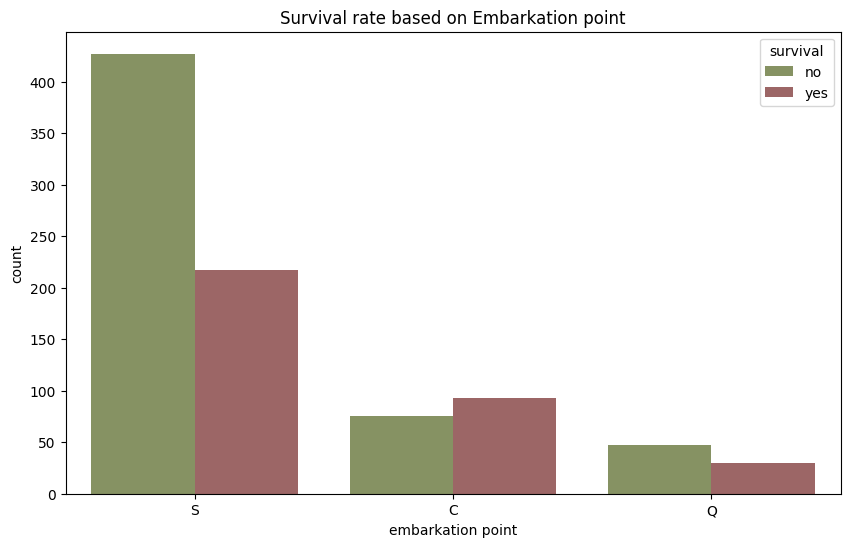

#### 💵 Survival rate based on Fare charges (`histplot`)

    

#### 👨‍👩‍👧‍👦 Survival rate based on Family size (`countplot`)

    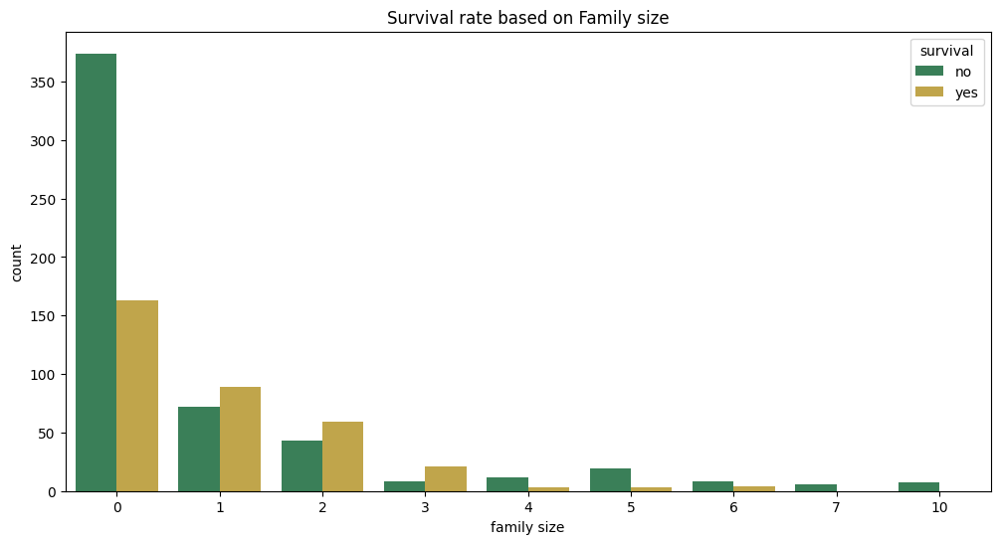

#### 🧭 Survival rate based on Age group (`countplot`)

    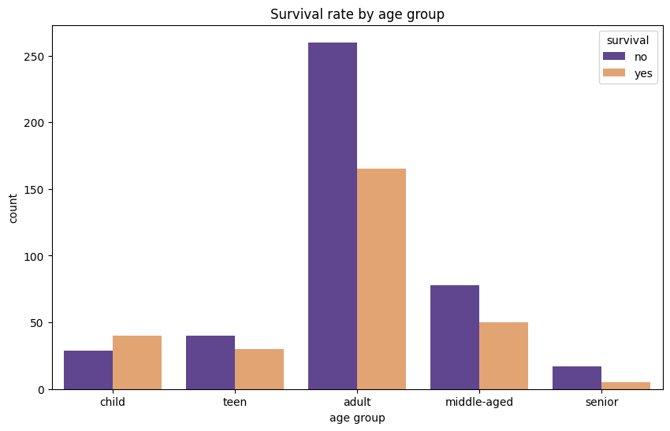

---

### 7. 🔎 Advanced visualization (Correlation Heatmap)

-   Pearson correlation matrix for numerical features

    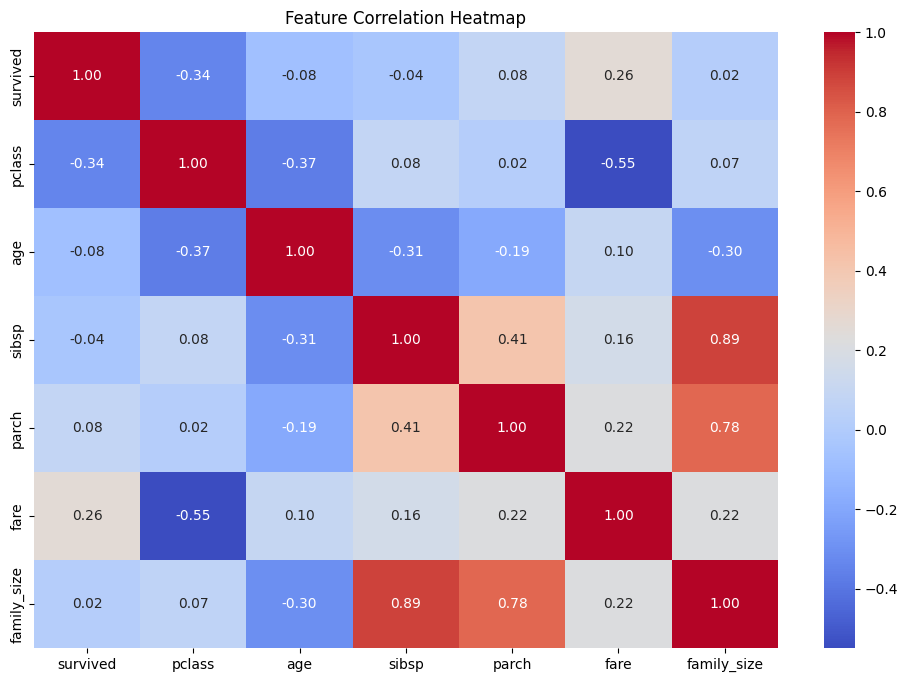

---

## ✅ Conclusion

This visual analysis helps us understand what factors matter the most in the game of survival. The notebook delved deeper into the correlations between various factors like _age_, _sex_, _passenger class_, _embarkment points_, etc to evaluate survival rates.
